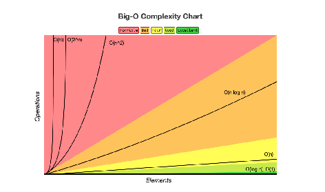

# ALGORITMOS
Estudos sistematizados sobre algoritmos.
## [BIG 0](https://github.com/Robson-Maestro/Algoritmos/tree/master/BIG_O)
1. [Tempo Constante O(1)](https://github.com/Robson-Maestro/Algoritmos/tree/master/BIG_O/01_Tempo_Constante.ipynb)
2. [Tempo Linear O(n)](https://github.com/Robson-Maestro/Algoritmos/tree/master/BIG_O/02_Tempo_Linear.ipynb)
3. [Tempo Logarítmico 0(log n)](https://github.com/Robson-Maestro/Algoritmos/tree/master/BIG_O/03_Tempo_Logaritmico.ipynb)
4. [Tempo Quadrático O(n^2)](https://github.com/Robson-Maestro/Algoritmos/tree/master/BIG_O/04_Tempo_Quadrático.ipynb)
5. [Tempo Expoencial O(2^n)](https://github.com/Robson-Maestro/Algoritmos/tree/master/BIG_O/05_Tempo_Expoencial.ipynb)
6. [Tempo Fatorial O(n!)](https://github.com/Robson-Maestro/Algoritmos/tree/master/BIG_O/06_Tempo_Fatorial.ipynb)

## [HEURÍSTICAS E TÉCNICAS (Desafios)](https://github.com/Robson-Maestro/Algoritmos/tree/master/HEURISTICS)
Resolvidos e classificados quanto ao BIG_O em python.
1. [Compare_Binary_Trees.py](https://github.com/Robson-Maestro/Algoritmos/tree/master/HEURISTICS/Compare_Binary_Trees.py)
2. [Detect_Circular_Linked_List.py](https://github.com/Robson-Maestro/Algoritmos/tree/master/HEURISTICS/Detect_Circular_Linked_List.py)
3. [Longest_Increasing_Path_In_A_Matrix.py](https://github.com/Robson-Maestro/Algoritmos/tree/master/HEURISTICS/Longest_Increasing_Path_In_A_Matrix.py)
4. [Longest_Substring_Without_Repeating_Characters.py](https://github.com/Robson-Maestro/Algoritmos/tree/master/HEURISTICS/Longest_Substring_Without_Repeating_Characters.py)
5. [Max_Consecutives_Ones.py](https://github.com/Robson-Maestro/Algoritmos/tree/master/HEURISTICS/Max_Consecutives_Ones.py)
6. [Maximum_Path_Sum.py](https://github.com/Robson-Maestro/Algoritmos/tree/master/HEURISTICS/Maximum_Path_Sum.py)
7. [Minimum_Depth_Of_Binary_Tree.py](https://github.com/Robson-Maestro/Algoritmos/tree/master/HEURISTICS/Minimum_Depth_Of_Binary_Tree.py)
8. [Path_Sum_2.py](https://github.com/Robson-Maestro/Algoritmos/tree/master/HEURISTICS/Path_Sum_2.py)
9. [Three_Sum.py](https://github.com/Robson-Maestro/Algoritmos/tree/master/HEURISTICS/Three_Sum.py)
10. [Two_Sum.py](https://github.com/Robson-Maestro/Algoritmos/tree/master/HEURISTICS/Two_Sum.py)
11. [Word_Search.py](https://github.com/Robson-Maestro/Algoritmos/tree/master/HEURISTICS/Word_Search.py)

### Resolução dos desafios utiliando o [ELIXIR](https://github.com/Robson-Maestro/Algoritmos/tree/master/HEURISTICS/desafios_elixir/)

## [Agradecimentos Especiais]
Ao Tiago Brito e seu projeto [AlgoMania](https://algomania.com.br/) por compartilhar seus conhecimentos de forma simples e eficaz e permitir a divulgação deste conteúdo.

